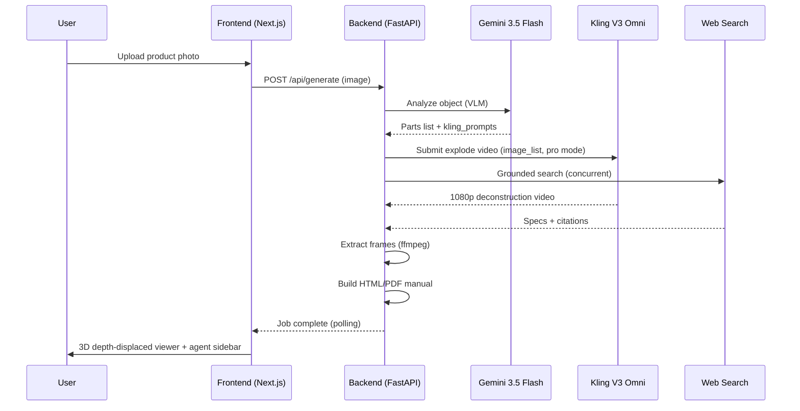
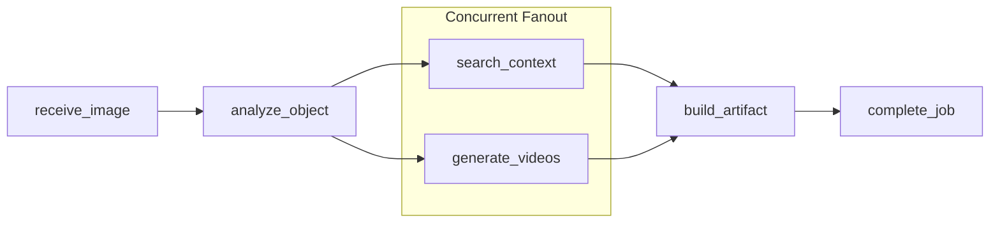

<div align="center">

# Parallax — Exploded Parts Explorer

**AI-powered visual manual generator** — upload a product photo, get an interactive 3D/2D exploded-view manual with parts analysis, web-sourced context, and AI-generated animations.

[](http://localhost:3000)
[](https://fastapi.tiangolo.com)
[](https://nextjs.org)
[](https://klingai.com)
[](https://ai.google.dev)

</div>

---

## 🎬 Demo


> *Upload a product photo → Gemini analyzes parts → Kling V3 Omni generates a 3D deconstruction video → interactive exploded-view viewer with AI agent sidebar*

---

## 🧠 How It Works



### Pipeline Architecture

The backend uses a **subagent fanout** pattern — after Gemini analyzes the object, video generation and web search run **concurrently**, achieving a **2.8x speedup**:



### Benchmarks (`printer.jpg` sample)

| Metric | Sequential | Concurrent | Speedup |
|--------|-----------|------------|---------|
| **Total wall time** | ~120s | **42.7s** | **2.8x** |
| Search queries | ~12s | ~5s | 2.4x |
| Frame extraction | ~10s | ~5s | 2x |
| UI progress updates | End only | **Per node** | Real-time |

> See [`docs/design.md`](docs/design.md) for the full architectural design document.

---

## 📁 Project Structure

```
parallax-snaplii/
├── backend/                    # FastAPI backend — pipeline, adapters, MCP server
│   ├── main.py                 # API endpoints + job orchestration
│   ├── graph.py                # Pipeline DAG with concurrent fanout
│   ├── pipeline_runner.py      # Job persistence + intermediate state streaming
│   ├── llm.py                  # Gemini 3.5 Flash client (vision + video understanding)
│   ├── search.py               # Gemini grounded search (concurrent fanout)
│   ├── frames.py               # ffmpeg frame extraction
│   ├── jobs.py                 # In-memory job store
│   ├── config.py               # Settings (API keys, model IDs, timeouts)
│   ├── adapters/
│   │   ├── kling.py            # Kling V3 Omni adapter (image-to-video, 1080p pro)
│   │   ├── gmi_ie.py           # GMI Cloud request-queue adapter
│   │   ├── image_gen.py        # GPT-Image-2 adapter (part renders)
│   │   ├── fallback.py         # Placeholder frames when API is unavailable
│   │   └── snaplii.py          # Snaplii action integration
│   ├── nodes/
│   │   ├── receive_image.py    # Image validation + hashing
│   │   ├── analyze_object.py   # Gemini VLM → part plan + kling_prompts
│   │   ├── search_context.py   # Web search enrichment
│   │   ├── generate_videos.py  # Kling V3 Omni video gen + frame extraction
│   │   ├── build_artifact.py   # HTML/PDF manual rendering
│   │   └── complete_job.py     # Final status
│   └── printer.jpg             # Sample printer image for testing
│
├── frontend/frontend/          # Next.js Parallax frontend
│   ├── app/
│   │   ├── page.tsx            # Main UI (3D + 2D modes, agent sidebar)
│   │   ├── layout.tsx          # Root layout + fonts
│   │   └── parallax.css        # Global styles
│   ├── components/
│   │   └── two-d-stage.tsx     # 2D video frame-scrub viewer
│   ├── lib/
│   │   ├── parallax-viewer.ts  # Three.js 3D viewer (depth-displaced mesh)
│   │   ├── api.ts              # Backend API client
│   │   ├── contract.ts         # Shared types
│   │   ├── explode.ts          # Explode animation utilities
│   │   └── use-speech.ts       # Voice narration hook
│   ├── backend/                # Frontend-embedded backend copy (Vercel deploy)
│   └── public/demo-cache/      # Cached pipeline results for demo mode
│
└── docs/
    ├── design.md               # Pipeline concurrency design document
    └── assets/
        ├── parallax-demo.gif   # Demo recording
        └── default-2d-landing.png  # 2D landing screenshot
```

---

## 🚀 Quick Start

### Prerequisites

| Requirement | Version |
|-------------|---------|
| Python | 3.11+ |
| Node.js | 18+ |
| ffmpeg | any (for frame extraction) |
| GMI Cloud API key | Required (Gemini VLM + Kling V3 Omni) |

### 1. Backend

```bash
pip install -r backend/requirements.txt

# Create backend/.env with your API keys
cp frontend/backend/.env.example backend/.env
# Edit backend/.env and add your GMI_API_KEY and GMI_MAAS_API_KEY

uvicorn backend.main:app --host 0.0.0.0 --port 8000 --reload
```

### 2. Frontend

```bash
cd frontend/frontend
npm install
npm run dev
```

Open [http://localhost:3000](http://localhost:3000)

### 3. Try the Demo

1. Click **"Upload / New"** → **"Use sample part"** to load a cached pipeline result
2. Toggle between **3D Demo** (interactive Three.js exploded view) and **2D Demo** (video frame-scrub)
3. Drag the **explode/frame slider** to animate the disassembly
4. Try the **agent buttons** ("Show how it comes apart", "Run it apart") for automated animations

---

## 🎥 Modes

| Mode | Description | Output |
|------|-------------|--------|
| **3D** | Three.js depth-displaced mesh with orbit/zoom, floating part labels, luminance-based depth maps | WebGL canvas, part selection, explode slider |
| **2D** | Kling V3 Omni video frame-scrub with auto-play loop | HTML5 video, frame slider, 24 extracted frames |

---

## 🔌 API Endpoints

| Endpoint | Method | Description |
|----------|--------|-------------|
| `/api/generate` | POST | Submit image, start pipeline (returns `job_id`) |
| `/api/jobs/{job_id}` | GET | Poll job status + intermediate state |
| `/api/jobs/{job_id}/manual` | GET | Download rendered HTML manual |
| `/api/jobs/{job_id}/manual.pdf` | GET | Download rendered PDF manual |
| `/api/jobs/{job_id}/review-video` | POST | AI video quality judgment via Gemini 3.5 Flash |
| `/api/agent` | POST | Agent chat endpoint (parts Q&A) |
| `/health` | GET | Health check |
| `/credentials` | GET | API key configuration status |

---

## 🔑 Environment Variables

| Variable | Required | Description |
|----------|----------|-------------|
| `GMI_API_KEY` | ✅ | GMI Cloud API key (Kling video generation) |
| `GMI_MAAS_API_KEY` | ✅ | GMI MaaS API key (Gemini VLM + chat) |
| `GMI_IE_MODEL_API_KEY` | ✅ | GMI IE model API key (image/video models) |
| `VIDEO_MODEL_ID` | ❌ | Kling model ID (default: `kling-v3-omni`) |
| `GMI_MODELS` | ❌ | Comma-separated chat model IDs (default: `google/gemini-3.5-flash`) |
| `MAX_VIDEO_WAIT_SEC` | ❌ | Max poll time for video generation (default: 300) |
| `FRAME_COUNT` | ❌ | Frames to extract per video (default: 24) |
| `TAVILY_API_KEY` | ❌ | Tavily search API key (optional search) |
| `SNAPLII_API_BASE` | ❌ | Snaplii API base URL |
| `SNAPLII_API_KEY` | ❌ | Snaplii API key |

---

## 🛠️ Tech Stack

| Layer | Technology |
|-------|-----------|
| **Backend** | FastAPI, Python 3.11, asyncio, httpx |
| **VLM** | Gemini 3.5 Flash (via GMI Cloud) — object analysis, video understanding |
| **Video Gen** | Kling V3 Omni (via GMI Cloud) — 1080p pro mode, 3D Spacetime physics |
| **Frontend** | Next.js 15, React, TypeScript |
| **3D Viewer** | Three.js — depth-displaced mesh, luminance depth maps, orbit controls |
| **Frame Extraction** | ffmpeg |
| **Search** | Gemini grounded search (concurrent fanout) |

---

## 📄 License

This project is for educational/demo purposes.

